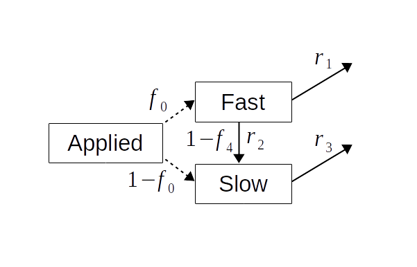

# ALFAM2
Model for ammonia volatilization (loss) from field-applied manure.

# Maintainer
Sasha D. Hafner.
Contact information here: <https://au.dk/sasha.hafner@bce.au.dk>.

# Installation
Installation of packages from GitHub requires a package called devtools.
You can run the code below to install devtools and ALFAM2.

If you don't already have it, first install devtools from CRAN.

```
install.packages("devtools")
```

Then install the latest ALFAM2 release with the following command.

```
devtools::install_github("sashahafner/ALFAM2@*release", build_vignettes = TRUE)
```

You can just pull from the master branch (`sashahafner/ALFAM2`), but you may get some new changes not yet included in a release.

*You can get any specific release (e.g., to check out a specific version used in a particular paper) with this syntax:*

```
devtools::install_github("sashahafner/ALFAM2@v3.2", build_vignettes = TRUE)
```

See the [Releases page](https://github.com/sashahafner/ALFAM2/releases) for all available releases.
The `@v3.2` bit in the command above is from the release *tag*.

For other branches using the `ref` argument.

# Package use
Once the package is installed, load it.

```
library(ALFAM2)
```

And see a vignette to get started.

```
vignette("ALFAM2-start")
```

# Model description
The following paper describes the model in some detail:

Hafner, S.D., Pacholski, A., Bittman, S., Carozzi, M., Chantigny, M., Génermont, S., Häni, C., Hansen, M.N., Huijsmans, J., Kupper, T., Misselbrook, T., Neftel, A., Nyord, T., Sommer, S.G., 2019. A flexible semi-empirical model for estimating ammonia volatilization from field-applied slurry. Atmospheric Environment 199: 474-484. <https://doi.org/10.1016/j.atmosenv.2018.11.034>

Download a copy [here](https://drive.google.com/file/d/1UEzmjApe2kMs4CyX6dUQIqn0ZOZ8elV9/view?usp=sharing).

As shown in the figure below, the ALFAM2 model tracks applied ammonia (as "total ammoniacal nitrogen", TAN) after field application.
The numerical value of the "primary" parameters shown below (r and f terms) determine the rate and trajectory of emission.
The value of these parameters are determined by the value of predictor variables and the "secondary" parameter set.



# Bugs and requests
Please use the [Issues](https://github.com/sashahafner/ALFAM2/issues) page.

# Project information
See www.alfam.dk for more information and resources.
