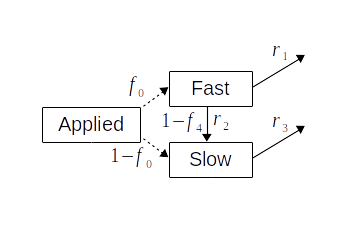

# ALFAM2
Model for ammonia volatilization (loss) from field-applied manure.

# Model schematic


# Installation
Installation of packages from GitHub requires a package called devtools.
You can run the code below to install devtools and ALFAM2.

First, install devtools from CRAN.

```
install.packages("devtools")
```

Then install ALFAM2.

```
devtools::install_github("sashahafner/ALFAM2", build_vignettes = TRUE)
```

# Latest version
To update ALFAM2 to the latest version, run the following two commands in R.
This assumes that devtools is installed and you want the *latest* version of ALFAM2.

```
remove.packages("ALFAM2")
devtools::install_github("sashahafner/ALFAM2", ref = "dev", build_vignettes = TRUE)
```

# Package use
Once the package is installed, load it.

```
library(ALFAM2)
```

And see this vignette to get started.

```
vignette("ALFAM2-start")
```

# Bugs and requests
Please use the Issues page.

# Project information
See www.alfam.dk for information and more resources.
